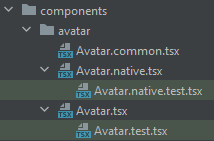
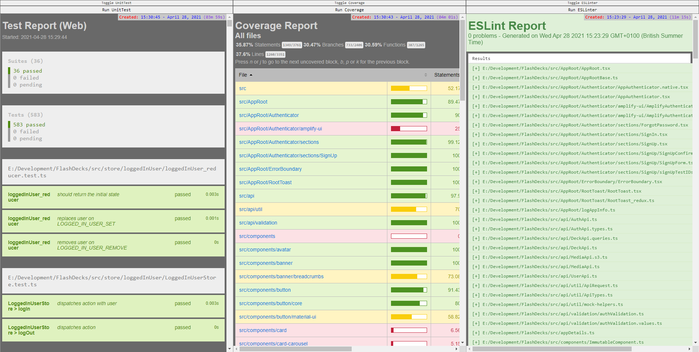

# FlashDecks
This is a medium size project used to practice, explore and showcase using [React Native](https://reactnative.dev/) 
and [AWS Amplify](https://aws.amazon.com/amplify/).

## Hosting
To confirm what's being seen, the app includes a light blue `InfoBanner` which displays the version number + commit, with the UI branch and API environment. 
* **Web Version**  
  * [Production Branch](https://master.dxccldee9zefn.amplifyapp.com) 
  * [Development Branch](https://dev.dxccldee9zefn.amplifyapp.com) 
* **Mobile Version**  
  * [Expo App](https://expo.io/@michaelfuller/projects/FlashDecks)
  
### Logging In
For your convenience the log-in fields are pre-filled with a demo account, but signing up is fully functional.  
You can use a disposable email account from a provider such as [Guerrilla Mail](https://www.guerrillamail.com/).

## About the app
FlashDecks is a web/mobile app that lets users create and share collections of "Flash Cards".

Flash Cards are a study tool where a question is on one side, and answers are on the reverse.  
Since these cards are digital they can contain media which physical cards don't, such as video and links.  

It is not available on iOS, as I don't have an iOS device to test it on.

# Development
* [Setting Up](docs/Setup.md)

## Client Architecture
I'm using [React Native](https://reactnative.dev/) & [Expo](https://expo.io/) to build both a web and native mobile app using with one codebase.
  
### Code Separation
Some components may need to be different between web and native builds, due to different layout or behavior requirements.  

React Native allows us to split builds by adding platform suffixes to file extensions.  
For example; if we have `Component.tsx` & `Component.native.tsx`, then the `.native` file replaces the original in native builds.
I create a `Component.common.ts` file that is shared between both web and native versions of the component.  
  

When a component needs to be split between platforms, I take one of two approaches:
#### Functional components 
The `Component.common.ts` file defines the component properties, so they're consistent between both versions.  
To maintain cross-platform compatibility, it's the component signature must be consistent.
#### Class components
Like the functional components, I define the properties in a `Component.common.ts` file.  
I may also specify an abstract base class they both use, so they can share functionality.  

This functionality should ideally be just business logic (rather than view/ui logic) in order to maintain separation of concerns between the platforms.  
As such, I tend to leave defining the State to the different implementations, as state is tied to the view.

### Environment Variables
Environment variables are injected into `app.config.js`'s [extra](https://docs.expo.io/guides/environment-variables/#using-app-manifest--extra) property when Expo runs.  
If a value is not found, I make it fall back onto a `.env` file, which is helpful for local development.  
The environment variables are set on the [Amplify server](https://docs.aws.amazon.com/amplify/latest/userguide/environment-variables.html).

## Server Architecture
For the back-end, I'm using [Amazon Web Services](https://aws.amazon.com/). Because this is a relatively simple app, I'm using [Amplify](https://aws.amazon.com/amplify/) to streamline the process.  
### Services
* **[Auth](https://docs.amplify.aws/lib/auth/getting-started/q/platform/js)**  
Uses [AWS Cognito](https://aws.amazon.com/cognito/) to store and authenticate registered users.
* **[API (GraphQL)](https://docs.amplify.aws/lib/graphqlapi/getting-started/q/platform/js)**  
The [GraphQL](https://graphql.org/) API to request & submit app data. It uses [AWS DynamoDB](https://aws.amazon.com/dynamodb/) as the NoSQL data store.  
Because we're using Amplify, the database structure and operations are handled behind the scenes.
* **[Functions](https://docs.amplify.aws/cli/function)**  
Used for a custom GraphQL resolver, using [AWS Lambda](https://aws.amazon.com/lambda/), that lets us connect to Cognito and pull the requested user as part of a query.
* **[Storage](https://docs.amplify.aws/lib/storage/getting-started/q/platform/js)**  
An [AWS S3](https://aws.amazon.com/s3/) bucket is used to store the media users upload for their cards.

## Client Testing
The app can do [Unit](https://en.wikipedia.org/wiki/Unit_testing), [Coverage](https://en.wikipedia.org/wiki/Code_coverage) and [Lint](https://en.wikipedia.org/wiki/ESLint) tests.  
I started by working in a TDD workflow, but dropped it as it didn't suit the exploratory prototyping nature of the project.  
I progressed enough to feel confident with testing and removed tests that needed rewriting in the future as tests get backfilled.  

The "test after" approach isn't recommended in most projects, as it can lead to; 
* Untestable code that needs rewriting.
* Logical gaps in testing which aren't flagged by coverage tests.
* Less thought-through code.
* Worse self-documenting descriptions in tests.
* Compromises on testing as deadlines approach.

I started using [Enzyme](https://enzymejs.github.io/enzyme/) in the tests, as it's the most popular test helper, 
but then adopted [React Testing Library](https://testing-library.com/docs/react-testing-library/intro/) 
as its recommended in the official React documentation, and seems to be the direction the community's going in.

### Test Reports
As part of creating a TDD-friendly workflow, I made a custom [ExpressJS](https://expressjs.com/) service 
which hosts a webpage that watches and outputs the reports generated by the Unit, Coverage and Lint tests - along with a button to run them.  
For clarity, the reports have a ticker showing their age in real-time.  
The service can be run using `npm run test:reports` & unit tests can be run using `npm test`.  

## Client Frameworks & Libraries
* **[React Native](https://reactnative.dev/)**  
This is used to create the client for both browser and mobile app.
* **[TypeScript](https://www.typescriptlang.org/)**  
A superset of JavaScript that is transpiled back to vanilla JS.
* **[Expo](https://expo.io/)**  
A tool to help with the creation, building, running & hosting of React Native apps.
* **[Amplify](https://aws.amazon.com/amplify/)**  
A client library to help with using Amazon Web Services.
* **[React Redux](https://react-redux.js.org/)**  
[Redux](https://redux.js.org/) integration for React, including the [Store](https://redux.js.org/api/store), to help manage the app's state.
* **[Material-UI](https://material-ui.com/) / [NativeBase](https://nativebase.io/)**  
React component libraries for the web & native apps respectively.
* **[Immer](https://immerjs.github.io/immer/)**  
This library is used to facilitate immutability.  
It's built into the Redux reducers, and our **ImmutableComponent** + **ImmutablePureComponent** base classes.  
The [use-immer](https://github.com/immerjs/use-immer) hook has also been added.
* **[Jest](https://jestjs.io/)**  
The default testing tool for React.
* **[Enzyme](https://enzymejs.github.io/enzyme/) / [React Testing Library](https://testing-library.com/docs/react-testing-library/intro/)**  
Libraries to help with testing React components.
* **[Gulp](https://gulpjs.com/)**  
A task runner used to write tasks too complex to be written as an NPM script.  
They can be invoked as an NPM script.

# Future Development Possibilities
* Convert to an [Next.js](https://nextjs.org/) app.
* Create Media API  
To access S3 from, rather than direct from client, which exposes the bucket.  
An API also allows us to do some validation, such as file size/type checks.  
Using this as a proxy would stop 403 error occurring when watching a video so long the temporary S3 credentials expire (15mins).  
If the app us converted to a Next.js app, this can be achieved using [server-side rendering](https://nextjs.org/docs/basic-features/pages#server-side-rendering).
